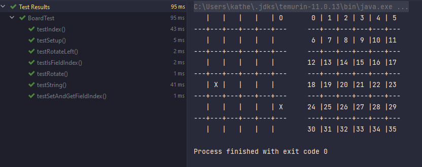

# Pentago - yellow-3
University of Twente. Technical Computer Science/Applied Mathematics M2:Software systems final project. Pentago game is presented using Java.
##Table of contents
* [General info](#general-info)
* [Setup](#setup)
* [Protocol](#protocol)
* [Testing](#testing)
* [Screenshots](#screenshots)

##General info

####Pentago rules
Game starts with empty board consisting of 4 sub-blocks of dimension 3x3 (total 36 cells). Two players (X and O marks) make moves one after another, the first move belongs to the player with X mark. The single move consists of choosing cell and rotating one of the four blocks 90 degrees clockwise our counter-clockwise. The player can twist any block to rotate regardless which block was chosen to place mark on.

The winning condition is either collecting five marks of the same type in a row (line, column or diagonal), or  the situation when all cells are occupied.

####Featuers

The game is played on the server that supports multiple games at the same time. Also, a user is free to choose whether to play against other human player, or vs computer player of two difficulty level.

##Setup
To start the game you are asked whether to create server or become a client. If there is no open server, type **SERVER** in console and type preferred port number. Now the program is ready to accept clients.

To become a client start program again and type **CLIENT** in console whenever asked. Then you are required to choose the host. Type *localhost* to play on the same device or input preferred ip to support game on different devices. Type port number. 

To login for the server, type your username after the port was accepted. In case chosen username already exists in the system, you are asked to try again.

To start game choose game option by choosing suitable for you option. After that, you are asked whether to start game. By answering 0 you join the queue to find the second player in case of multiplayer option, otherwise the game starts immediately. When the game is started, mark are assigned automatically and the first move is suggested to one of the players. Players exchange moves one by one until game is over as described in the rules or some of the players has disconnected.

##Testing
MVC pattern was used when creating a project. Testing for model part is performed as white-box testing using JUnit5. Controller (server) testing was completed in terms of black-bocks as the project supports multithreading and all data exchange between client and server includes many connected methods that are necessary to complete the program correctly.
As unit tests we present:

1. Board test, that checks whether board correctly process the user's move and updates its state.

2. MarkChangeTest - checks whether X mrk changes to O mark and vice versa
3. GameTest - ensures whether winning conditions are processed correctly: namely 5 in line, 5 in column, 5 in diagonal. Additionally, whether board resets correctly by removing all placed marks, and whether the game knows that board is full and there is no empty cell.
4. ComputerTest - (TO WRITE)

##Screenshots